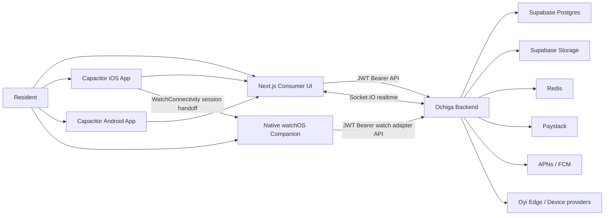

# Oyi Home Consumer OS Handbook

**Product:** Oyi Home Consumer OS  
**Purpose:** Resident-facing living intelligence operating system  
**Documentation snapshot:** May 30, 2026  
**Consumer release candidate:** `aebc6bc95913db94dc61fcc1dae2db03fd537f66`  
**Production API:** `https://oyi-os.onrender.com`

This handbook documents the implemented Consumer system, its API contracts, native applications, integration surfaces, operational workflows, and remaining external release prerequisites.

Oyi Home is not an estate administration dashboard. It is the resident surface for controlling and understanding a home inside the Ochiga/Oyi ecosystem. Office OS and Facility OS own fleet, estate, staff, edge, registry, and infrastructure operations. Consumer OS intentionally exposes only home-scoped, permission-aware residential experiences.

---

## 1. System Scope

Oyi Home provides:

- Authenticated resident access.
- Active estate and home context switching.
- Spatial room navigation through Spaces.
- Device discovery, assigned-device visibility, and safe control.
- Activity aggregation across home events.
- Estate community updates and direct resident messaging.
- Visitor invitations and access visibility.
- Maintenance request creation and tracking.
- Wallet funding, verification, and payment history.
- Managed residential services.
- Home security, camera playback, and utility status surfaces.
- Permissioned AI commands with audit and confirmation handling.
- Native iOS and Android wrappers through Capacitor.
- Native Apple Watch session handoff and watch-safe command APIs.

The system uses real backend data where available. Missing integrations render unavailable, empty, or pending states. Production UI must not fabricate values.

---

## 2. Architecture



### Runtime layers

| Layer | Technology | Responsibility |
| --- | --- | --- |
| Consumer web runtime | Next.js 15, React 19, TypeScript | Resident UI, routing, service wrappers, state, responsive layouts |
| Mobile wrapper | Capacitor | Static export packaging, native keyboard, push, speech, haptics, device bridges |
| iOS native bridge | Swift | WatchConnectivity sender and iOS-specific integration |
| Apple Watch | SwiftUI | Glanceable home awareness, voice-first commands, confirmations |
| API | Express, TypeScript | Auth, scoping, permissions, command routing, persistence, audits |
| Data | Supabase Postgres and Storage | Resident, estate, home, device, activity, community, wallet, avatar data |
| Realtime | Socket.IO | Home event updates, device state updates, community live sessions |
| Cache/runtime dependency | Redis | OTP runtime dependency and backend services |

---

## 3. Repository Map

### Consumer repository

```text
/Users/ochigaidoko/Oyi-os-frontend
```

Important paths:

| Path | Purpose |
| --- | --- |
| `src/app` | Next.js routes and Consumer pages |
| `src/app/components` | Shared Consumer shell, bridges, navigation, device UI |
| `src/services` | API wrappers and integration services |
| `src/hooks` | Auth, context, realtime, and device state hooks |
| `src/store` | Zustand stores for session, devices, settings, notifications, events |
| `ios/App` | Capacitor iOS workspace and native plugin |
| `android` | Capacitor Android project |
| `native/watchos/OyiWatch` | Native Apple Watch SwiftUI project |
| `native/wearos` | Wear OS foundation, if enabled in the local checkout |

### Backend repository

```text
/Users/ochigaidoko/Documents/Ochiga-backend
```

Important paths:

| Path | Purpose |
| --- | --- |
| `src/app.ts` | API route mounting |
| `src/routes` | Express routes |
| `src/services` | Watch adapter, AI command router support, domain services |
| `src/core/foundation/permissions.ts` | Canonical roles and permissions |
| `src/middleware/auth.ts` | JWT authentication and permission enforcement |
| `supabase/migrations` | Supabase CLI migration workflow |

---

## 4. Configuration

### Consumer environment variables

Create a local `.env.local`. Never commit it.

```bash
NEXT_PUBLIC_API_URL=https://oyi-os.onrender.com
NEXT_PUBLIC_SUPABASE_URL=<SUPABASE_URL>
NEXT_PUBLIC_SUPABASE_ANON_KEY=<SUPABASE_ANON_KEY>
NEXT_PUBLIC_GOOGLE_MAPS_KEY=<OPTIONAL_GOOGLE_MAPS_KEY>
NEXT_PUBLIC_PAYSTACK_PUBLIC_KEY=<PAYSTACK_PUBLIC_KEY>
```

### Backend environment categories

The backend must receive secrets only through the deployment environment. Do not expose service-role, Redis, payment secret, provider credentials, or signing material to Consumer code.

Required categories include:

| Category | Examples | Notes |
| --- | --- | --- |
| API runtime | `PORT`, app JWT secret | Required by backend authentication |
| Supabase | URL, service role key | Server-only |
| Redis | `REDIS_URL` | Required at backend startup by OTP services |
| Paystack | secret key, webhook configuration | Server-only |
| Push | APNs / Firebase credentials | Required for production push |
| Avatar storage | `PROFILE_AVATAR_BUCKET` | Defaults to `profile-avatars` |
| AI | `OPENAI_API_KEY` | Optional; safe deterministic AI routing remains available without it |

If Render reports `Missing env var: REDIS_URL`, the running Render service has not received `REDIS_URL`, even if a similarly named key exists in another environment group or service. Verify the environment group is attached to the deployed backend service and redeploy.

---

## 5. Local Development

### Install and run Consumer

```bash
cd /Users/ochigaidoko/Oyi-os-frontend
npm install
npm run dev
```

Default browser URL:

```text
http://localhost:3000
```

### Validate Consumer

```bash
npx tsc --noEmit --pretty false --incremental false
npm run lint
npm run build
```

### Sync native projects

```bash
npx cap sync ios
npx cap sync android
```

### Run backend locally

```bash
cd /Users/ochigaidoko/Documents/Ochiga-backend
npm install
npm run build
npm start
```

Consumer defaults to `http://localhost:5000` when `NEXT_PUBLIC_API_URL` is unset.

---

## 6. Authentication, Session, and Context

### Authentication flow

1. User requests an OTP.
2. User verifies the OTP.
3. Backend issues an OTP gate token.
4. Signup uses the OTP token and identity fields.
5. Login uses email and password.
6. Backend returns the application JWT.
7. Consumer stores the JWT for web and Capacitor session restore.
8. Consumer fetches `/me/context` after boot to refresh estate and home context.

### API authentication

Authenticated requests use:

```http
Authorization: Bearer <TOKEN>
X-Ochiga-Surface: consumer
X-Oyi-Contract-Version: ochiga.tier1.2026-05-16
```

The Consumer API wrapper resolves the token in this order:

1. In-memory token.
2. `localStorage` key `oyi_consumer_token_ls`.
3. Legacy `localStorage` key `oyi_consumer_token`.
4. Cookie `oyi_consumer_token`.

The iOS WebView relies on local storage restoration. Web can use the cookie fallback.

### Auth endpoints

| Method | Path | Authentication | Purpose |
| --- | --- | --- | --- |
| `POST` | `/auth/otp/send` | Public | Send OTP |
| `POST` | `/auth/otp/verify` | Public | Verify OTP and receive OTP gate token |
| `POST` | `/auth/signup` | OTP gate | Create account |
| `POST` | `/auth/login` | Public | Authenticate resident |
| `POST` | `/auth/onboard/complete` | Authenticated | Complete onboarding |

Signup example:

```bash
curl -X POST "$BASE_URL/auth/signup" \
  -H "Content-Type: application/json" \
  -H "x-otp-token: <OTP_GATE_TOKEN>" \
  -d '{
    "email": "resident@example.com",
    "password": "<PASSWORD>",
    "full_name": "Resident Name"
  }'
```

Login example:

```bash
curl -X POST "$BASE_URL/auth/login" \
  -H "Content-Type: application/json" \
  -d '{
    "email": "resident@example.com",
    "password": "<PASSWORD>"
  }'
```

### Active context

Context is home-scoped and estate-aware.

| Method | Path | Purpose |
| --- | --- | --- |
| `GET` | `/me/context` | Return active user, estate, and home context |
| `GET` | `/me/contexts` | List homes available to the authenticated user |
| `POST` | `/me/context/select` | Switch active home using `{ "home_id": "..." }` |

The Home selector uses these endpoints. It never invents homes or creates an unsupported join flow.

### Profile endpoints

| Method | Path | Purpose |
| --- | --- | --- |
| `PATCH` | `/me/profile` | Update supported profile fields |
| `POST` | `/me/profile/avatar` | Upload authenticated profile avatar |
| `DELETE` | `/me/profile/avatar` | Remove profile avatar |
| `DELETE` | `/me/account` | Account deletion flow |

Avatar upload accepts a base64 image payload, validates image MIME type and size, writes to Supabase Storage, updates `avatar_url` or `profile_image_url`, and returns the updated profile. The frontend does not receive storage secrets.

Example:

```bash
curl -X POST "$BASE_URL/me/profile/avatar" \
  -H "Authorization: Bearer <TOKEN>" \
  -H "Content-Type: application/json" \
  -d '{
    "base64": "<BASE64_IMAGE_OR_DATA_URL>",
    "mime": "image/jpeg",
    "filename": "avatar.jpg"
  }'
```

### Current authentication limitations

- Password recovery and reset flows are not implemented end-to-end yet.
- Google sign-in is intentionally disabled.
- Apple sign-in is intentionally disabled.

Do not present these as available authentication methods until backend and release configuration are complete.

---

## 7. Authorization Model

Every sensitive backend route must use `requireAuth` and, where applicable, `requirePermission`.

### Canonical roles

```text
super_admin
ochiga_admin
ochiga_staff
estate_admin
facility_manager
security_operator
maintenance_operator
finance_operator
resident
guest
ai_agent
```

### Resident permissions

The current resident role receives:

```text
estates.read
homes.read
devices.read
devices.control
visitors.create
wallets.read
support.read
community.read
community.write
notifications.read
```

The Consumer UI must hide or disable actions that require permissions not held by the active resident.

### Key permission families

| Domain | Permissions |
| --- | --- |
| Homes | `homes.read`, `homes.write` |
| Devices | `devices.read`, `devices.control` |
| Cameras | `cameras.view` |
| Visitors | `visitors.create`, `visitors.manage` |
| Wallet | `wallets.read`, `wallets.manage` |
| Maintenance | `support.read`, `support.assign` |
| Community | `community.read`, `community.write`, `community.moderate`, `community.broadcast`, `community.manage_announcements` |
| Notifications | `notifications.read`, `notifications.manage` |
| Twin | `twin.view`, `twin.control` |

---

## 8. Consumer Route Guide

### Primary navigation

| Route | Resident experience |
| --- | --- |
| `/home` | Ambient home overview, home selector, status strip, Oyi orb, quick controls |
| `/spaces` | Interactive living environment and room-focused Digital Twin placeholder |
| `/activity` | Real environmental heartbeat feed |
| `/community` | Estate notices, resident updates, amenity and communication layer |
| `/profile` | Identity, integrations, access, preferences, logout, deletion |

### Secondary routes

| Route | Purpose |
| --- | --- |
| `/devices` | Favorite controls, categories, room grouping, assigned devices, attention states |
| `/devices/integrations` | Connected systems view |
| `/messages` | Direct resident and operator inbox |
| `/visitors` | Visitor invitation and access status |
| `/maintenance` | Residential service requests and status |
| `/wallet` | Home operations wallet and payment history |
| `/services` | Managed living services |
| `/security` | Resident security state, locks, cameras, support links |
| `/utilities` | Residential power, water, internet, HVAC, meter availability |
| `/reports` | Resident reports and document history |
| `/ai` | Full-screen AI conversation surface |
| `/invites` | Home invitation handling |
| `/room` | Room control details |
| `/rooms` | Compatibility route for Spaces |
| `/watch` | Development/reference-only Watch concept preview |

### Redirects and aliases

| Route | Behavior |
| --- | --- |
| `/account` | Redirects permanently to `/profile` experience |
| `/settings` | Redirects to `/profile` |
| `/notifications` | Reuses `/activity` |
| `/spaces` | Uses the current Spaces implementation |
| `/rooms` | Compatibility access to the same room-focused implementation |

The production native Apple Watch app is not the `/watch` web page. Real Watch code lives under `native/watchos/OyiWatch`.

---

## 9. Core Resident Modules

### Home

Home is the ambient landing surface.

Implemented behavior:

- Dynamic local-time greeting using authenticated profile name where available.
- Active home selector backed by `/me/contexts` and `/me/context/select`.
- Compact real-data status strip.
- Oyi orb as the single ambient AI entry.
- Favorite controls using existing device command services.
- Native-safe responsive layout.

### Spaces

Spaces is a room-first living environment view.

Implemented behavior:

- Real room data loading.
- Real assigned-device relationships.
- Synchronized room chips and tappable Twin room selection.
- Selected-room summary.
- Favorite room controls.
- Active-scenes area when supported.
- Bottom-sheet details.
- Responsive portrait stacking and landscape side-by-side layout.

The floorplan visual is a lightweight placeholder until Digital Twin data is available. Room names, selection, device controls, and empty states remain data-driven.

### Devices

Devices is a resident control surface, not a hardware registry.

Implemented behavior:

- Real favorite devices.
- Device category mapping.
- Devices grouped by room.
- Search.
- Direct toggles for simple reversible controls.
- Contextual details for complex devices.
- User-friendly state formatting.
- Attention section only when real issues exist.

Raw provider state, Tuya codes, registry fields, edge details, and telemetry payloads must never render in normal Consumer UI.

### Activity

Activity is the environmental heartbeat.

Implemented behavior:

- Real aggregation from backend activity endpoints.
- Filters for all activity, alerts, devices, and people.
- Summary counts.
- User-friendly event mapping.
- Loading, empty, error, and refresh states.
- Aliased route mounting under `/activity` and `/api/activity`.

### Community

Community is an estate communication layer, not a public social feed.

Implemented behavior:

- Estate-scoped real posts.
- Notices, amenities, residents, and updates tabs.
- Permission-aware post composer.
- Comments and reactions.
- Media upload.
- Read receipts and post reports.
- Live broadcast routes.
- Category, targeting, and moderation-aware backend support.

### Profile

Profile is the single resident account surface.

Implemented behavior:

- Authenticated name and email.
- Avatar upload, preview, save, and removal.
- Initials fallback.
- Account overview based on real home/device/member/security values.
- Homes and access.
- Security and notification links.
- Connected systems.
- Preferences.
- Watch sync.
- Logout confirmation.
- Account deletion or support fallback.

`/account` and `/settings` no longer provide separate legacy account experiences.

---

## 10. API Conventions

Use:

```bash
BASE_URL=https://oyi-os.onrender.com
TOKEN=<AUTHENTICATED_JWT>
```

Authenticated request pattern:

```bash
curl "$BASE_URL/me/context" \
  -H "Authorization: Bearer $TOKEN" \
  -H "X-Ochiga-Surface: consumer" \
  -H "X-Oyi-Contract-Version: ochiga.tier1.2026-05-16"
```

### Route prefixes

The backend does not use a universal `/api` prefix.

Use the route exactly as documented. Activity and Community intentionally support compatibility aliases:

```text
/activity/*
/api/activity/*

/community/*
/api/community/*
```

---

## 11. Devices and Signals API

### Device endpoints

| Method | Path | Permission | Purpose |
| --- | --- | --- | --- |
| `GET` | `/devices/discover` | `devices.read` | Discover available devices |
| `POST` | `/devices/assign` | `devices.control` | Assign device |
| `GET` | `/devices/estate/:estateId` | `devices.read` | List estate devices visible to user scope |
| `GET` | `/devices/:deviceId/state` | `devices.read` | Fetch normalized device state |
| `POST` | `/devices/:deviceId/command` | `devices.control` | Execute device command |
| `POST` | `/signals` | `devices.control` | Submit normalized signal envelope |
| `POST` | `/signals/device/:deviceId/command` | `devices.control` | Device command signal alias |

Device command example:

```bash
curl -X POST "$BASE_URL/devices/<DEVICE_ID>/command" \
  -H "Authorization: Bearer $TOKEN" \
  -H "Content-Type: application/json" \
  -d '{
    "command": "turn_on"
  }'
```

### Device control rules

| Device class | Consumer behavior |
| --- | --- |
| Light, socket, relay, simple switch | Direct reversible toggle |
| AC, TV, IR remote, thermostat, heater | Contextual control sheet |
| Lock, gate, access devices | Permission-aware; sensitive operations require confirmation |
| Camera | Playback and event visibility only when permitted |
| Sensor | Read-only state and history where available |

### Device icon normalization

Consumer uses centralized device classification based on:

1. Device type.
2. Category.
3. Capabilities.
4. Name fallback.

Supported families include TV, climate, light, lock, camera, curtain, fan, plug, switch, sensor, thermostat, IR remote, speaker, purifier, and heater.

---

## 12. Rooms API

| Method | Path | Permission | Purpose |
| --- | --- | --- | --- |
| `GET` | `/rooms?homeId=<HOME_ID>` | `homes.read` | List home rooms |
| `POST` | `/rooms` | `homes.write` | Create room |
| `PUT` | `/rooms/ai/:roomId` | `homes.write` | Update room intelligence settings |
| `POST` | `/rooms/assign` | `homes.write` | Assign device or entity to room |

Consumer primarily uses read and device-control behavior. Room mutation is normally an estate or home-owner workflow.

---

## 13. Activity API

| Method | Path | Purpose |
| --- | --- |
| `GET` | `/activity/feed` | Get scoped activity feed |
| `GET` | `/activity/summary` | Get activity counts |
| `GET` | `/api/activity/feed` | Compatibility alias |
| `GET` | `/api/activity/summary` | Compatibility alias |

Activity can aggregate:

- Notifications.
- Device status updates.
- AI execution ledger records.
- Visitor activity.
- Maintenance activity.
- Community activity.
- Security and system events where available.

If a source is unavailable, the API should report source metadata and continue with available sources instead of failing the whole feed.

---

## 14. AI Command API

### AI endpoints

| Method | Path | Purpose |
| --- | --- |
| `POST` | `/ai/chat` | Submit authenticated text or voice transcript |
| `GET` | `/ai/tools` | List current tool registry |
| `GET` | `/ai/executions?limit=<N>` | List scoped execution ledger |
| `GET` | `/ai/confirmations?limit=<N>` | List confirmation queue |
| `POST` | `/ai/confirmations/:id/confirm` | Confirm pending command |
| `POST` | `/ai/confirmations/:id/cancel` | Cancel pending command |

Example:

```bash
curl -X POST "$BASE_URL/ai/chat" \
  -H "Authorization: Bearer $TOKEN" \
  -H "Content-Type: application/json" \
  -d '{
    "message": "Turn off the living room light",
    "context": {
      "surface": "consumer",
      "home_id": "<HOME_ID>"
    }
  }'
```

### AI safety model

All AI actions route through backend command infrastructure. Frontend action payloads are never trusted as direct device commands.

| Risk class | Examples | Behavior |
| --- | --- | --- |
| Safe read | Summaries, status, open module, search | Execute when authenticated and scoped |
| Low-risk reversible | Light toggle, basic switch, AC toggle, AC setpoint | Execute after permission and scope checks |
| Sensitive | Lock, gate, visitor mutation, heater, turn off all | Require explicit confirmation |
| High-risk or disabled | Wallet mutation, admin mutation, lockdown, camera disable | Remain disabled or require future admin approval workflow |

### Initial AI tool registry

| Tool | Status | Notes |
| --- | --- | --- |
| `summarize_estate` | Enabled | Read-only |
| `summarize_devices` | Enabled | Read-only |
| `summarize_support` | Enabled | Read-only |
| `summarize_wallet` | Enabled | Read-only |
| `summarize_readiness` | Enabled | Read-only Office scope |
| `open_module` | Enabled | UI navigation |
| `search_documents` | Enabled | Permissioned |
| `search_support` | Enabled | Permissioned |
| `get_ai_status` | Enabled | Read-only |
| `device_command` | Enabled | Scoped execution and confirmations |
| `support_mutation` | Enabled with confirmation | Sensitive write |
| `visitor_create` | Disabled scaffold | Future confirmation flow |
| `wallet_mutation` | Disabled | Not allowed |
| `twin_control` | Disabled | Not allowed |
| `admin_mutation` | Disabled | Not allowed |

### AI audit events

```text
ai.command.received
ai.tool.requested
ai.tool.executed
ai.tool.denied
ai.voice.transcribed
ai.response.generated
ai.command.confirmation.required
ai.command.confirmed
ai.command.cancelled
ai.action.failed
device.command.requested
device.command.executed
```

---

## 15. Community API

| Method | Path | Purpose |
| --- | --- |
| `POST` | `/community/post` | Create post |
| `GET` | `/community/posts/estate/:estateId` | Estate feed |
| `GET` | `/community/post/:postId` | Read post |
| `PUT` | `/community/post/:postId` | Edit post |
| `DELETE` | `/community/post/:postId` | Delete post |
| `POST` | `/community/post/:postId/view` | Record view |
| `POST` | `/community/post/:postId/read` | Record read |
| `POST` | `/community/post/:postId/report` | Report post |
| `POST` | `/community/post/:postId/comment` | Add comment |
| `GET` | `/community/post/:postId/comments` | List comments |
| `PUT` | `/community/comment/:commentId` | Edit comment |
| `DELETE` | `/community/comment/:commentId` | Delete comment |
| `POST` | `/community/post/:postId/react` | React to post |
| `POST` | `/community/comment/:commentId/react` | React to comment |
| `POST` | `/community/media/upload` | Upload community media |
| `POST` | `/community/live/start` | Start permitted live broadcast |
| `GET` | `/community/live/config` | Live configuration |
| `GET` | `/community/live/:postId` | Live session |
| `POST` | `/community/live/:postId/stop` | Stop live session |
| `GET` | `/community/live/:postId/requests` | Join requests |
| `GET` | `/community/live/:postId/chat` | Live chat |

Supported categories:

```text
announcement
notice
amenity
resident
maintenance
security
event
service
live
```

Community actions are estate-scoped and permission-aware.

---

## 16. Messages API

| Method | Path | Purpose |
| --- | --- |
| `GET` | `/messages/residents?q=<QUERY>` | Search messageable residents |
| `POST` | `/messages/presence/ping` | Presence heartbeat |
| `GET` | `/messages/inbox` | Inbox |
| `POST` | `/messages/thread/direct` | Create or get direct thread |
| `GET` | `/messages/thread/:threadId/messages` | Thread messages |
| `POST` | `/messages/thread/:threadId/messages` | Send message |
| `POST` | `/messages/thread/:threadId/read` | Mark thread read |
| `POST` | `/messages/media/upload` | Upload message media |
| `POST` | `/messages/message/:messageId/report` | Report message |
| `GET` | `/messages/mod/reports` | Moderation report queue |
| `POST` | `/messages/mod/reports/:reportId/resolve` | Resolve moderation report |

The Consumer conversation surface aligns outgoing messages to the resident side and incoming messages to the peer side. Tokens and raw upload payloads are not exposed in UI.

---

## 17. Visitors and Maintenance API

### Visitors

| Method | Path | Purpose |
| --- | --- |
| `POST` | `/visitors` | Create resident visitor invitation |
| `GET` | `/visitors/mine` | List resident visitor records |
| `POST` | `/visitors/verify` | Privileged verification |
| `PUT` | `/visitors/approve/:id` | Privileged approval |
| `POST` | `/visitors/entry/:id` | Record entry |
| `POST` | `/visitors/exit/:id` | Record exit |
| `GET` | `/visitors/info/:id` | Visitor information |
| `GET` | `/visitors/analytics/estate/:estateId` | Privileged analytics |

Resident invite example:

```bash
curl -X POST "$BASE_URL/visitors" \
  -H "Authorization: Bearer $TOKEN" \
  -H "Content-Type: application/json" \
  -d '{
    "name": "Visitor Name",
    "phone": "+234...",
    "purpose": "Visit",
    "navigation_mode": "gate",
    "expires_hours": 4
  }'
```

### Maintenance

| Method | Path | Purpose |
| --- | --- |
| `GET` | `/maintenance?status=<STATUS>&homeId=<HOME_ID>` | List scoped requests |
| `POST` | `/maintenance` | Create request |

Example:

```bash
curl -X POST "$BASE_URL/maintenance" \
  -H "Authorization: Bearer $TOKEN" \
  -H "Content-Type: application/json" \
  -d '{
    "home_id": "<HOME_ID>",
    "title": "AC service request",
    "description": "Cooling has reduced.",
    "category": "hvac",
    "priority": "normal"
  }'
```

Facility operations own assignment, escalation, and staff workflows.

---

## 18. Wallet and Managed Services API

### Wallet

| Method | Path | Purpose |
| --- | --- |
| `GET` | `/wallets` | Get wallet state and history |
| `POST` | `/wallets/init` | Initialize Paystack funding |
| `GET` | `/wallets/verify/:reference` | Verify payment reference |
| `POST` | `/wallets/verify` | Verify payment body |
| `POST` | `/wallets/webhook` | Paystack server callback |
| `POST` | `/wallets/debit` | Permissioned debit |

### Managed services

| Method | Path | Purpose |
| --- | --- |
| `GET` | `/services/config` | Get configured services |
| `PATCH` | `/services/config/:serviceKey` | Privileged configuration |
| `POST` | `/services/pay` | Pay configured service |
| `GET` | `/services/payments` | Resident service payment history |
| `GET` | `/services/estate/payments` | Privileged estate payment history |

Service keys:

```text
utility_token
water_service
internet_service
fiber_internet
service_charge
other_facility_fees
```

Review resident access to `/services/config` before final service-catalog rollout: the current backend configuration route is privileged with `settings.manage`, while residents should only receive a safe published catalog view.

---

## 19. Cameras API

| Method | Path | Permission | Purpose |
| --- | --- | --- | --- |
| `POST` | `/cameras/scan` | `cameras.view` | Scan cameras |
| `GET` | `/cameras/estate/:estateId` | `cameras.view` | List estate cameras |
| `POST` | `/cameras/bind` | `devices.control` | Bind camera |
| `POST` | `/cameras/bind-from-discovery` | `devices.control` | Bind discovered camera |
| `GET` | `/cameras/reports/security` | `cameras.view` | Security report |
| `GET` | `/cameras/:cameraId/hls-token` | `cameras.view` | Issue short-lived playback token |
| `GET` | `/cameras/:cameraId/playback` | `cameras.view` | Get playback URL |
| `GET` | `/cameras/:cameraId/events` | `cameras.view` | List camera events |
| `POST` | `/cameras/:cameraId/events` | `cameras.view` | Create camera event |
| `GET` | `/cameras/analytics/capabilities` | `cameras.view` | Analytics capabilities |
| `GET` | `/cameras/:cameraId/ai/profile` | `cameras.view` | AI profile |
| `PUT` | `/cameras/:cameraId/ai/profile` | `devices.control` | Update AI profile |
| `GET` | `/cameras/:cameraId/hls.m3u8?token=...` | Short-lived query token | HLS playlist proxy |
| `GET` | `/cameras/:cameraId/hls/:seg?token=...` | Short-lived query token | HLS segment proxy |

HLS routes intentionally use short-lived query tokens because media players do not reliably attach bearer headers to playlist and segment requests.

---

## 20. Notifications and Push

### API

| Method | Path | Purpose |
| --- | --- |
| `GET` | `/notifications` | List notifications |
| `POST` | `/notifications/read/:id` | Mark notification read |
| `POST` | `/push/register` | Register native push token |
| `POST` | `/push/unregister` | Unregister native push token |

Registration payload:

```json
{
  "token": "<NATIVE_PUSH_TOKEN>",
  "platform": "ios",
  "device_id": "<DEVICE_ID>",
  "app_version": "<APP_VERSION>"
}
```

### Native behavior

`PushNotificationsBridge`:

- Runs only when the Capacitor native push plugin is available.
- Requests permission safely.
- Registers tokens with backend.
- Handles foreground notifications.
- Uses local notifications and haptics where available.
- Does not crash web builds if native plugins are absent.

### Release prerequisites

- Add production APNs credentials and distribution entitlement validation.
- Add Android Firebase `google-services.json`.
- Validate push delivery on real iPhone and Android hardware.

---

## 21. Realtime Contracts

Consumer Socket.IO connection includes authenticated context and reconnect handling.

### Subscription events

```text
subscribe:user
subscribe:estate
subscribe:room
subscribe:thread
```

### Consumer-relevant inbound events

```text
signal
device:update
device.status.updated
visitor.created
maintenance.updated
office.notification
support.ticket.created
incident.created
community events
```

### Community live events

Community live sessions also use Socket.IO for host, viewer, guest request, signal, chat, join, leave, and stats flows.

Consumer pages should degrade gracefully to refresh-based behavior when realtime is unavailable.

---

## 22. Connected Systems and Plug Integrators

Consumer has an integration layer, not a generic third-party browser plugin SDK. New providers must be added through backend adapters and permission-aware frontend wrappers.

### Current connected systems

| Integration | Consumer status | Configuration model |
| --- | --- | --- |
| Tuya / Smart Life | Implemented | `/me/integrations/tuya` |
| Alexa | Implemented account-link record | `/me/integrations/alexa` |
| Google Assistant | Implemented account-link record | `/me/integrations/google_assistant` |
| Apple Home | UI intent only | Backend provider allowlist not enabled yet |
| Oyi Watch | Implemented native handoff | Capacitor plugin and WatchConnectivity |
| Oyi Edge | Indirect device runtime | Backend device and signal services |
| Paystack | Implemented wallet funding path | Backend wallet API |
| Supabase | Implemented backend data/storage | Server plus frontend anon configuration |

### Integration API

| Method | Path | Purpose |
| --- | --- | --- |
| `GET` | `/me/integrations/tuya` | Get Tuya link status |
| `PATCH` | `/me/integrations/tuya` | Save Tuya UID |
| `GET` | `/me/integrations/:provider` | Get supported generic provider status |
| `PATCH` | `/me/integrations/:provider` | Save generic external account ID |

Generic provider allowlist:

```text
tuya
alexa
google_assistant
```

### Add a new account integration

1. Add provider to the backend allowlist.
2. Add provider-specific server adapter if credentials or OAuth are required.
3. Store external references in server-side integration records.
4. Never return raw provider secrets to Consumer.
5. Add frontend type and service wrapper.
6. Add Profile connected-system row with real status only.
7. Apply estate, home, and identity scope.
8. Emit audit events for link, unlink, failure, and provider refresh.
9. Test disconnected, pending, connected, expired, and revoked states.

### Add a physical-device provider

1. Implement provider discovery or edge ingestion server-side.
2. Normalize devices into the canonical device model.
3. Store provider credential references server-side or edge-local only.
4. Do not send raw credentials to Consumer.
5. Add command adapter mapping.
6. Preserve `/devices/:deviceId/command` as the Consumer command boundary.
7. Emit normalized `device.status.updated` and audit events.
8. Add icon/category mapping only for resident-friendly display.
9. Verify offline, unauthorized, missing-device, and provider-failure handling.

---

## 23. Native iOS

### Capacitor project

```text
ios/App/App.xcworkspace
```

### Build and open

```bash
cd /Users/ochigaidoko/Oyi-os-frontend
npm run build
npx cap sync ios
open ios/App/App.xcworkspace
```

In Xcode:

1. Select the `App` scheme.
2. Select simulator or connected iPhone.
3. Configure signing team for real devices.
4. Confirm bundle identifier `com.ochiga.oyios`.
5. Build and run.

### Native bridges

| File | Purpose |
| --- | --- |
| `ios/App/App/OyiWatchSyncPlugin.swift` | WatchConnectivity sender |
| `ios/App/App/OyiBridgeViewController.swift` | Capacitor bridge registration |
| `src/app/components/CapacitorBoot.tsx` | Native startup |
| `src/app/components/ViewportKeyboardFix.tsx` | iOS viewport and keyboard behavior |
| `src/app/components/PushNotificationsBridge.tsx` | Push handling |

---

## 24. Native Android

### Capacitor project

```text
android
```

### Build

```bash
cd /Users/ochigaidoko/Oyi-os-frontend
npm run build
npx cap sync android
cd android
./gradlew assembleDebug
```

### Android release prerequisites

- Add production Firebase `google-services.json`.
- Configure release signing.
- Replace generated launcher and splash artwork with final store assets where required.
- Review Android Gradle Plugin compatibility warning before production upgrade.
- Validate push, keyboard, login restoration, device commands, and deep links on real Android hardware.

Bundle/application identifier:

```text
com.ochiga.oyios
```

---

## 25. Apple Watch Companion

### Production architecture

The real Apple Watch app is SwiftUI and embedded into the iOS workspace.

```text
native/watchos/OyiWatch/OyiWatch.xcodeproj
ios/App/App.xcworkspace
```

Bundle relationship:

```text
Parent iOS app: com.ochiga.oyios
Watch app:      com.ochiga.oyios.watch
WKCompanionAppBundleIdentifier: com.ochiga.oyios
```

### Session handoff

After login or session restoration, the iPhone opportunistically sends:

```json
{
  "backendBaseURL": "https://oyi-os.onrender.com",
  "bearerToken": "<JWT>",
  "userId": "<USER_ID>",
  "homeId": "<HOME_ID>",
  "estateId": "<ESTATE_ID>",
  "role": "resident"
}
```

The raw token is never logged.

The iPhone native plugin:

1. Checks `WCSession.isSupported()`.
2. Sets its delegate.
3. Activates the session.
4. Uses `updateApplicationContext` for durable state.
5. Uses `transferUserInfo` when paired and installed.
6. Uses `sendMessage` when reachable.
7. Returns diagnostic status to Profile.

The Watch receives session context, stores credentials in Keychain, and calls backend Watch endpoints.

### Watch endpoints

| Method | Path | Purpose |
| --- | --- | --- |
| `GET` | `/watch/home-status` | Real home state |
| `GET` | `/watch/glances` | Real watch-ready activity |
| `GET` | `/watch/quick-actions` | Real safe action list |
| `POST` | `/watch/command` | Send typed or speech transcript / action |
| `POST` | `/watch/confirm` | Confirm pending ledger action |
| `POST` | `/watch/cancel` | Cancel pending ledger action |

Watch command example:

```bash
curl -X POST "$BASE_URL/watch/command" \
  -H "Authorization: Bearer $TOKEN" \
  -H "Content-Type: application/json" \
  -d '{
    "command": "Turn off the living room light"
  }'
```

### Manual Watch sync test

1. Build Consumer and sync iOS.
2. Open `ios/App/App.xcworkspace`.
3. Select `App`, not only the standalone Watch project.
4. Run Oyi Home on connected iPhone.
5. Pair and unlock Apple Watch.
6. Log into Oyi Home.
7. Open Profile -> Connected Systems -> Oyi Watch.
8. Tap Sync Watch.
9. Open Oyi Watch.
10. Confirm real home status appears.
11. Trigger a safe quick action.
12. Trigger a sensitive action and verify confirmation.

### Watch verification commands

```bash
xcodebuild \
  -workspace ios/App/App.xcworkspace \
  -scheme App \
  -sdk iphonesimulator \
  -destination 'generic/platform=iOS Simulator' \
  build CODE_SIGNING_ALLOWED=NO

xcodebuild \
  -project native/watchos/OyiWatch/OyiWatch.xcodeproj \
  -scheme OyiWatch \
  -sdk watchsimulator \
  -destination 'generic/platform=watchOS Simulator' \
  build CODE_SIGNING_ALLOWED=NO
```

### Watch release prerequisites

- Validate session handoff on paired real iPhone and Apple Watch hardware.
- Configure production signing team and App Store assets.
- Validate production notification categories.
- Keep development simulator token variables uncommitted.

---

## 26. Supabase Migration Workflow

From backend:

```bash
cd /Users/ochigaidoko/Documents/Ochiga-backend
supabase login
supabase link --project-ref zcpgtdakqxyvjkmiibei
supabase migration list --linked
supabase db push --dry-run --linked
supabase db push --linked
```

Only run production `db push` after confirming the linked project and migration dry run.

Avatar storage requires:

- A Supabase Storage bucket named by `PROFILE_AVATAR_BUCKET` or default `profile-avatars`.
- Appropriate storage permissions for backend service-role writes.
- User profile support for `avatar_url`, `profile_image_url`, or the supported schema fallback.

Never place Supabase service-role credentials in Consumer environment files.

---

## 27. Verification Runbook

### Consumer

```bash
cd /Users/ochigaidoko/Oyi-os-frontend
npx tsc --noEmit --pretty false --incremental false
npm run lint
npm run build
npx cap sync ios
npx cap sync android
```

### Backend

```bash
cd /Users/ochigaidoko/Documents/Ochiga-backend
npm run build
```

### Android

```bash
cd /Users/ochigaidoko/Oyi-os-frontend/android
./gradlew assembleDebug
```

### iOS

```bash
cd /Users/ochigaidoko/Oyi-os-frontend
xcodebuild \
  -workspace ios/App/App.xcworkspace \
  -scheme App \
  -sdk iphonesimulator \
  -destination 'generic/platform=iOS Simulator' \
  build CODE_SIGNING_ALLOWED=NO
```

### Watch

```bash
cd /Users/ochigaidoko/Oyi-os-frontend
xcodebuild \
  -project native/watchos/OyiWatch/OyiWatch.xcodeproj \
  -scheme OyiWatch \
  -sdk watchsimulator \
  -destination 'generic/platform=watchOS Simulator' \
  build CODE_SIGNING_ALLOWED=NO
```

### Manual smoke checklist

```text
Auth signup/login
Session restore
Active home switch
Home greeting and status strip
Orb AI safe command
Orb AI sensitive confirmation
Spaces room selection
Spaces device control
Devices search and direct toggle
Activity feed and refresh
Community real feed and post
Messages send/receive alignment
Visitor invite
Maintenance request
Wallet funding initialization
Managed services empty/configured state
Security and camera playback
Profile avatar upload/remove
Profile Watch sync diagnostics
Account and settings redirects
iPhone push registration
Android native startup
Watch paired session handoff
Watch real quick action
```

---

## 28. Operational Troubleshooting

### Backend deploy fails with `Missing env var: REDIS_URL`

1. Open the deployed backend service environment in Render.
2. Confirm exact key `REDIS_URL`.
3. Confirm the environment group is attached to this service.
4. Confirm the value is available to runtime, not only preview or another service.
5. Save and redeploy.

### Consumer uses old UI after code update

```bash
cd /Users/ochigaidoko/Oyi-os-frontend
npm run build
npx cap sync ios
npx cap sync android
```

Rebuild and reinstall the native app. Capacitor ships static files from `out`; a Git commit alone does not refresh an installed native binary.

### Watch stays disconnected

1. Confirm iPhone and Watch are paired and unlocked.
2. Run from `ios/App/App.xcworkspace` using the `App` scheme.
3. Confirm Watch app is embedded and installed.
4. Open Oyi Home Profile -> Connected Systems -> Oyi Watch.
5. Use Refresh Status.
6. Tap Sync Watch.
7. Review paired, installed, reachable, activation state, token sent, backend URL sent, and last error.
8. Open the Watch app after sync.

`isReachable` can be false while durable `updateApplicationContext` still succeeds. Reachability is needed for immediate `sendMessage`, not for every handoff path.

### Avatar upload fails

1. Confirm backend migration is applied.
2. Confirm Supabase Storage bucket exists.
3. Confirm `PROFILE_AVATAR_BUCKET` if using a non-default bucket.
4. Confirm service-role storage access.
5. Confirm supported MIME type and payload size.
6. Confirm profile avatar columns exist.

### Android push does not register

1. Add `android/app/google-services.json`.
2. Configure Firebase project for `com.ochiga.oyios`.
3. Re-run `npx cap sync android`.
4. Rebuild APK.
5. Test on real Android hardware.

---

## 29. Release Readiness Boundaries

### Implemented in code

- Consumer UI unification.
- Primary and secondary resident modules.
- JWT authentication and session restoration.
- Home context selector.
- Device controls and normalized state display.
- Spaces room interactions.
- Activity aggregation.
- Community and messages.
- Profile avatar endpoint and UI.
- iOS and Android Capacitor projects.
- Embedded Apple Watch project and WatchConnectivity sender.
- Watch adapter endpoints.
- AI command routing, confirmation, ledger, and audit foundations.
- Backend build and Consumer builds.

### External rollout prerequisites

| Item | Status |
| --- | --- |
| Password recovery/reset | Not implemented |
| Google login | Disabled until implemented |
| Apple login | Disabled until implemented |
| Android Firebase configuration | Add `google-services.json` |
| Android release signing | Configure before Play Store |
| iOS APNs distribution validation | Verify before App Store |
| iOS App Store signing and assets | Configure in Apple Developer / Xcode |
| Real paired Watch session smoke | Run on production-like iPhone and Watch |
| Watch App Store assets | Finalize |
| Apple Home adapter | Backend provider enablement required |
| Resident-safe managed-services catalog route | Review before broad rollout |
| Final Android branding assets | Replace generated assets if needed |

The Consumer codebase is release-candidate complete, but store publication and production rollout remain gated by these platform and environment prerequisites.

---

## 30. Safe Extension Checklist

Before adding a Consumer feature:

1. Confirm the data is home-scoped and appropriate for residents.
2. Use an existing backend service when possible.
3. Add `requireAuth`.
4. Add the narrowest required permission.
5. Validate estate, home, room, and ownership scope.
6. Return user-friendly data, not raw provider payloads.
7. Add loading, error, empty, and offline states.
8. Emit audit events for sensitive actions.
9. Add realtime events only where they improve resident awareness.
10. Preserve native static-export compatibility.
11. Run web, iOS sync, Android sync, and relevant native builds.
12. Do not commit secrets, generated credentials, or local environment files.

---

## 31. Source-of-Truth Files

Consumer:

```text
src/services/api.ts
src/services/authService.ts
src/services/deviceService.ts
src/services/signalService.ts
src/services/activityService.ts
src/services/aiService.ts
src/services/communityService.ts
src/services/messagesService.ts
src/services/watchSyncService.ts
src/hooks/useAuth.tsx
src/store/useSessionStore.ts
src/app/layout.tsx
ios/App/App/OyiWatchSyncPlugin.swift
native/watchos/OyiWatch
```

Backend:

```text
src/app.ts
src/core/foundation/permissions.ts
src/middleware/auth.ts
src/routes/auth.ts
src/routes/me.routes.ts
src/routes/devices.ts
src/routes/signals.ts
src/routes/activity.ts
src/routes/aiRoutes.ts
src/routes/community.ts
src/routes/messages.ts
src/routes/visitors.ts
src/routes/maintenance.routes.ts
src/routes/wallets.ts
src/routes/services.ts
src/routes/cameras.ts
src/routes/watchRoutes.ts
src/services/watchAdapterService.ts
```

When code and this handbook diverge, update the handbook in the same pull request as the contract change.
